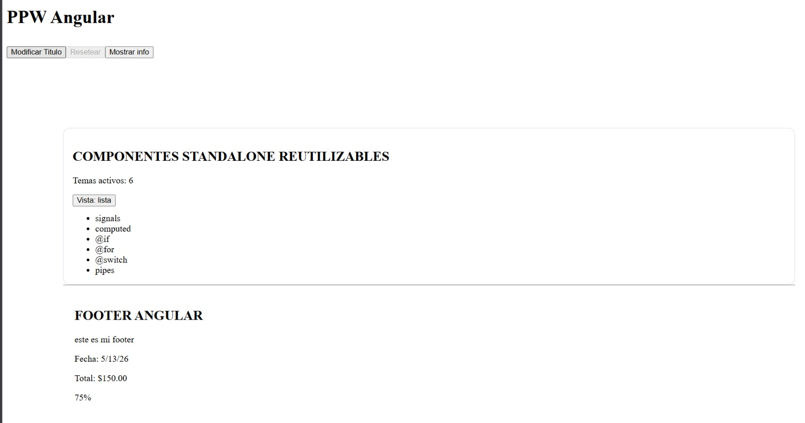
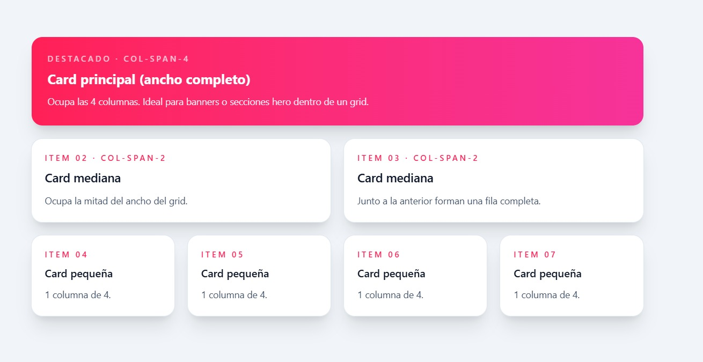
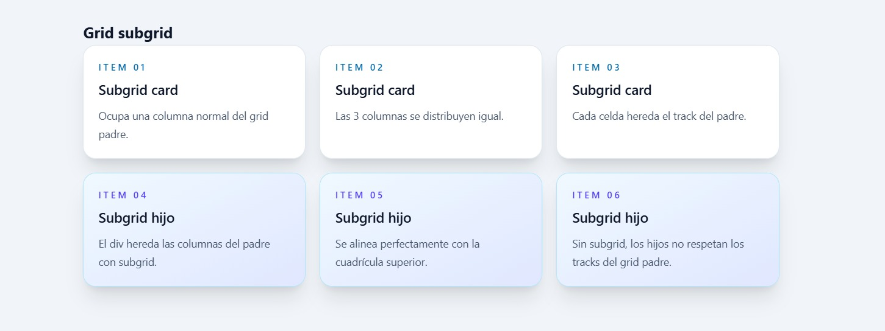
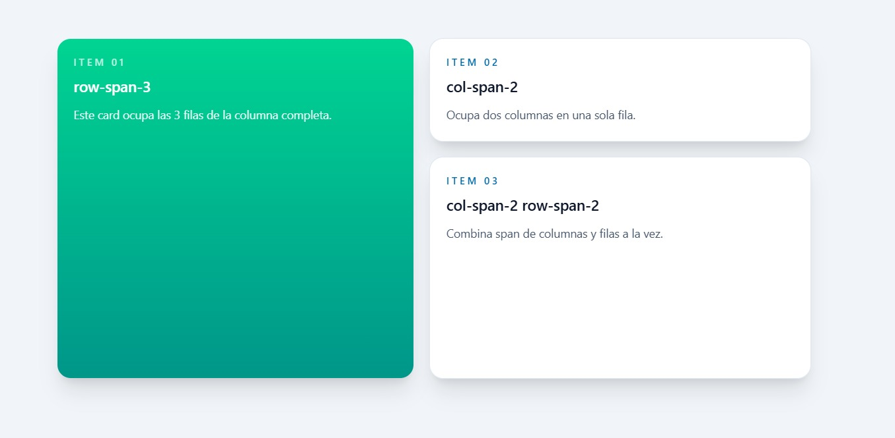
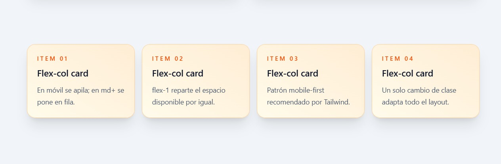
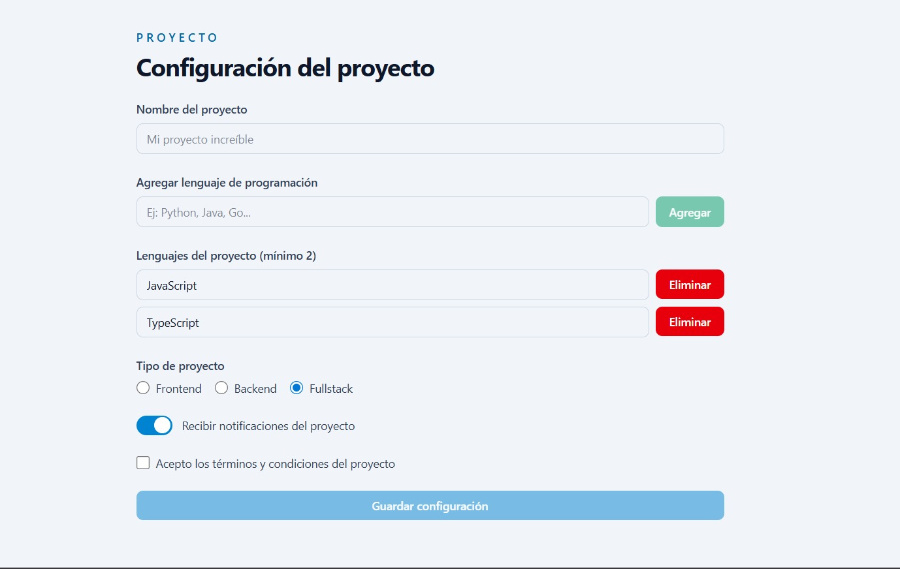
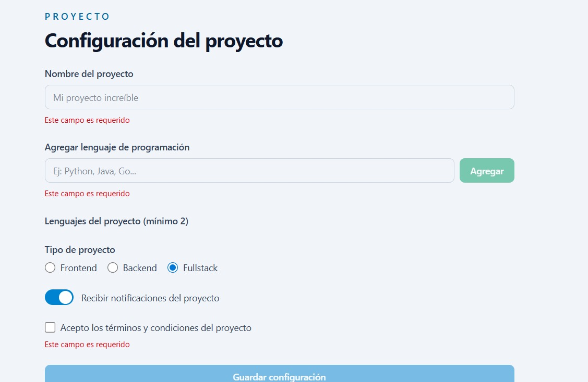
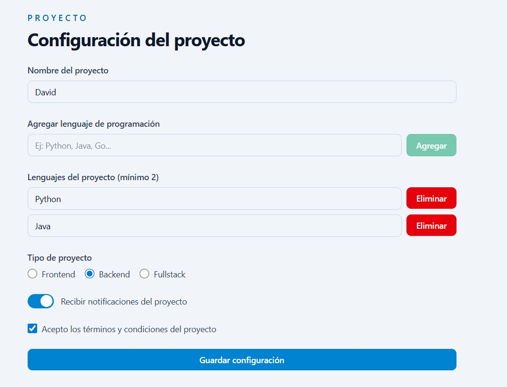
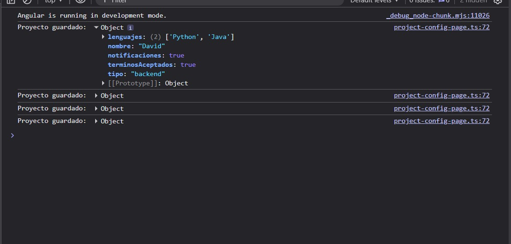

# CAPTURAS

## Cards con gradiente

Variante de cards que combina gradientes (`bg-linear-to-br`) con sombra. El gradiente añade profundidad visual sin necesidad de bordes ni imágenes. Se usa `from-*` y `to-*` para definir los colores de inicio y fin del degradado.

---

## Grid subgrid

Layout usando `grid-cols-3` en el padre y `col-span-3 grid-cols-subgrid` en un hijo. La segunda fila hereda los tracks de columnas del padre gracias a `subgrid`, logrando que los items hijos se alineen perfectamente con la cuadrícula superior sin necesidad de definir nuevas columnas.

---

## Grid rows + row-span

Layout con `grid-rows-3 grid-flow-col` donde un item usa `row-span-3` para ocupar toda la altura de la columna. Los demás items combinan `col-span-2` y `row-span-2` para crear una distribución asimétrica que genera jerarquía visual sin CSS adicional.

---

## Flex columna → fila

Layout con `flex flex-col md:flex-row` que demuestra el enfoque mobile-first de Tailwind. En pantallas pequeñas los items se apilan verticalmente; en pantallas medianas (`md:`) se distribuyen en fila horizontal. Cada item usa `flex-1` para repartir el espacio disponible de forma equitativa.

## PRACTICA 5 A

## PRACTICA 5 B

## PRACTICA 5 C

